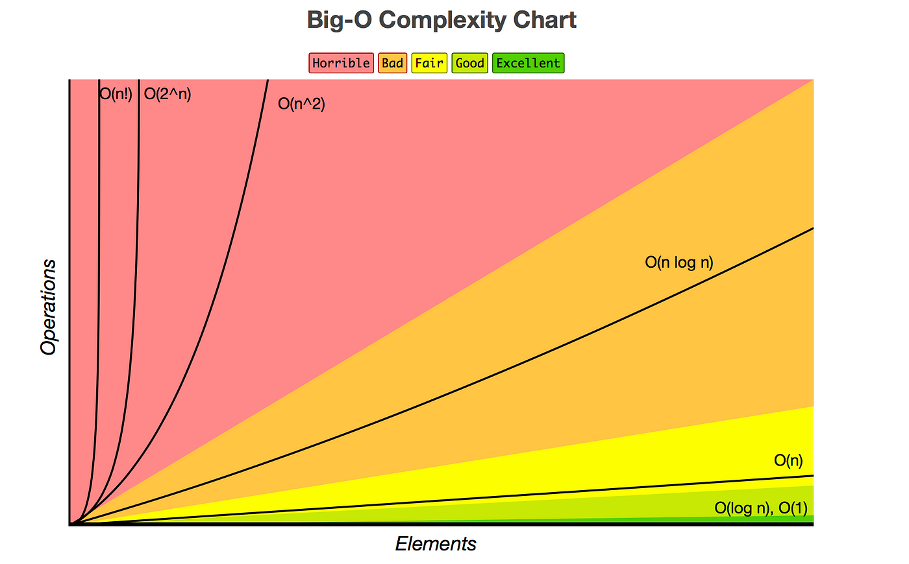
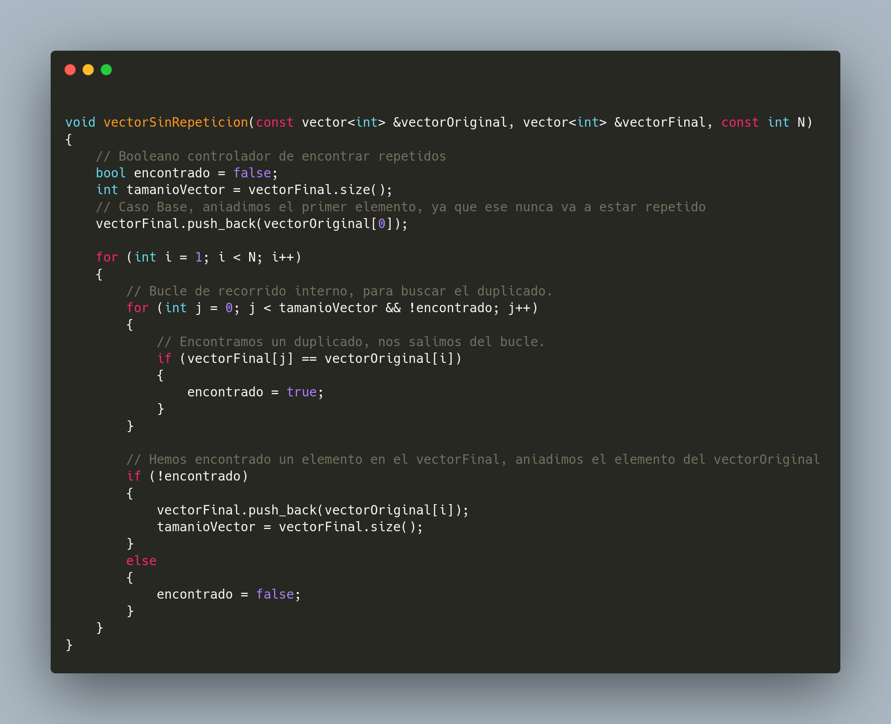
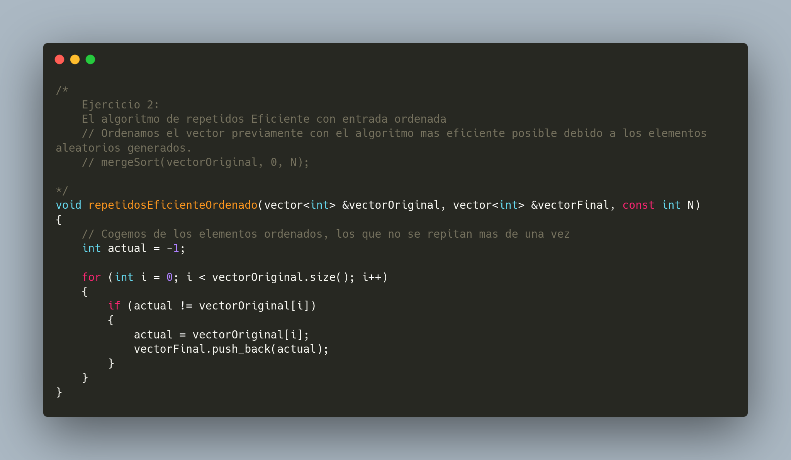
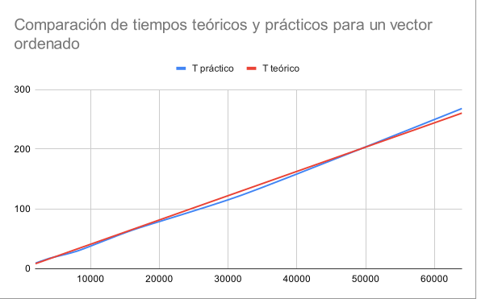
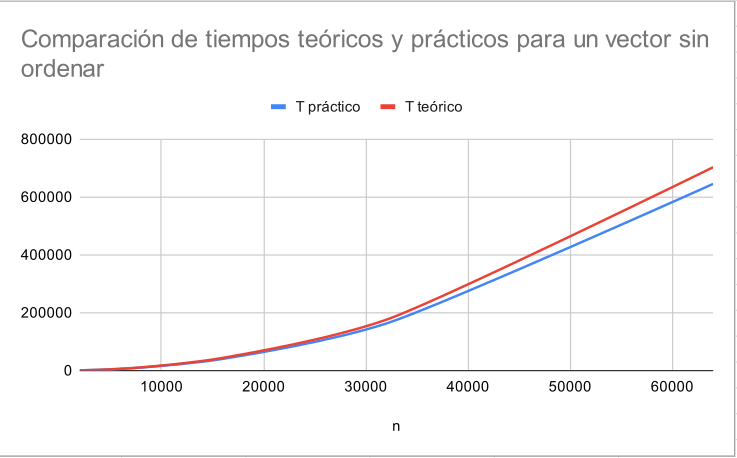

# Práctica 1: Análisis de eficiencia de algoritmos
## Autores: Pedro Antonio Mayorgas Parejo y Alejandro Ramos Peña

\newpage

# Table of contents
- [Análisis de eficiencia de algoritmos iterativos de ordenación.](#anlisis-de-eficiencia-de-algoritmos-iterativos-de-ordenacin)
  - [Pregunta 1 - *Diseño de algoritmo con elementos repetidos sin ordenar.*](#pregunta-1---diseo-de-algoritmo-con-elementos-repetidos-sin-ordenar)
  - [Pregunta 2 - *Diseño de algoritmo con elementos repetidos ordenados.*](#pregunta-2---diseo-de-algoritmo-con-elementos-repetidos-ordenados)
  - [Pregunta 3 - *Identificación de qué variables depende el problema en cada algoritmo diseñado.*](#pregunta-3---identificacin-de-qu-variables-depende-el-problema-en-cada-algoritmo-diseado)
  - [Pregunta 4 y 5 - *Identificación de los peores y mejores casos en cada algoritmo y cálculo de los órdenes de eficiencia.*](#pregunta-4-y-5---identificacin-de-los-peores-y-mejores-casos-en-cada-algoritmo-y-clculo-de-los-rdenes-de-eficiencia)
  - [Pregunta 6 - Pruebas experimentales de eficiencia teoríca y práctica.](#pregunta-6---pruebas-experimentales-de-eficiencia-teoríca-y-práctica)

\newpage

# Análisis de eficiencia de algoritmos iterativos de ordenación.

## Pregunta 1 - *Diseño de algoritmo con elementos repetidos sin ordenar.*
El algoritmo usado para la pregunta 1, es un algoritmo consistente es un doble bucle iterativo que para cada elemento N en un vector original sea repetido o no, se buscará en el vector de los no repetidos de tamaño N. Por lo tanto la eficiencia Big O, es de O(N²).

El fichero main se encuentra en **algoritmo_sin_ordenar.cpp**

El algoritmo que se encuentra en **algoritmos.hpp**, es la función llamada vectorSinRepeticion.

\newpage

## Pregunta 2 - *Diseño de algoritmo con elementos repetidos ordenados.*

El algoritmo usado para la pregunta 2, es un algoritmo consistente en un bucle iterativo simple que recorre todo el vector de manera obligatoria, para poder obtener los elementos (previamente ordenados) donde va pasando a un vector final donde pone los elementos sin repetición.

El algoritmo se encuentra en **algoritmos.hpp**, es la función llamada

\newpage

## Pregunta 3 - *Identificación de qué variables depende el problema en cada algoritmo diseñado.*

El tamaño del problema, depende del tamaño del vector que haya que analizar para quitar los duplicados de manera iterativa. Así como vamos a manejar la lógica de los datos procesados, es decir no solo es el vector de entrada que suele ser N siempre ya que tenemos que iterarlo entero, si no que cómo vamos a procesar dichos datos repetidos, en el algoritmo del ejercicio 2, es mucho más eficiente descartar los repetidos, ya que al estar ordenados no tenemos que desperdiciar accesos de lectura en el vector de salida, ya que con una simple variable auxiliar conocemos cuál es el elemento actual que puede o no repetirse en el vector original.

## Pregunta 4 y 5 - *Identificación de los peores y mejores casos en cada algoritmo y cálculo de los órdenes de eficiencia.*

En el caso del **ejercicio 1**, con un vector de entrada desordenado:

- Si usamos un algoritmo que tenga un bucle anidado consistente en usar el vector desordenado, donde para cada elemento N del vector principal, se compare con cada elemento N del vector de los no repetidos, donde si no existe ese elemento o todos los elementos sean distintos, *su peor caso es N².* *En el mejor de los casos*, existe un elemento igual y es N porque tenemos que ir comprobando en el vector de entrada si hay algún elemento disinto.

**Mejor caso:** Existe un único elemento, pero tenemos que comprobarlo en todo el vector de entrada.
**Peor caso:** Todos los elementos son diferentes. No hay ninguno igual, cada elemento del vector desordenado, tendría que ser comparado con el vector de elementos no repetidos, haciendo que cada iteración del vector desordenado recorra todo el vector de elementos no repetidos hasta encontrar o no una coincidencia.

**Órdenes de eficiencia**:

- *Eficiencia peor caso:* O(N²)
- *Eficiencia mejor caso:* O(N)

En el caso del **ejercicio 2**,donde el vector este ordenado:

- Se usa un bucle que recorra todo el vector, junto a una variable auxiliar que nos permita tener como índice el elemento actual hasta encontrar algún elemento distinto.

**Mejor caso y peor caso:** Da igual cómo se trabaje, el vector al estar ordenado junto al uso de una variable auxiliar, permite que se sepa cuál es el elemento actual para ir descartando rápidamente los repetidos. Solo necesita iterar sobre el vector de los elementos ordenados.

**Órdenes de eficiencia:**

- *Eficiencia mejor y peor caso:* O(N)

## Pregunta 6 - Pruebas experimentales de eficiencia teoríca y práctica.

Para la ejecución del algoritmo con los datos ordenados tenemos la siguiente tabla:

| N     | T(N) | K          | TE(N)       |
| ----- | ---- | ---------- | ----------- |
| 2000  | 9    | 0,0045     | 8,135416667 |
| 4000  | 17   | 0,00425    | 16,27083333 |
| 8000  | 29   | 0,003625   | 32,54166667 |
| 16000 | 64   | 0,004      | 65,08333333 |
| 32000 | 123  | 0,00384375 | 130,1666667 |
| 64000 | 268  | 0,0041875  | 260,3333333 |

Con un promedio de las constantes de: **0,004067708333**

El gráfico sería el siguiente:

Para la ejecución del algoritmo con los datos sin ordenar tenemos la siguiente tabla:

| N     | T(N)   | K               | TE(N)       |
| ----- | ------ | --------------- | ----------- |
| 2000  | 940    | 0,000235        | 686,3686523 |
| 4000  | 2567   | 0,0001604375    | 2745,474609 |
| 8000  | 19253  | 0,000160203125  | 10981,89844 |
| 16000 | 40338  | 0,0001575703125 | 43927,59375 |
| 32000 | 162624 | 0,0001588125    | 175710,375  |
| 64000 | 645241 | 0,000157529541  | 702841,5    |

Con un promedio de las constantes de: **0,0001715921631**

El gráfico sería el siguiente:

*Conclusiones:*

Es poco eficiente hacer un algoritmo iterativo para eliminar duplicados sin que los datos estén sin ordenar. Deberían ordenarse previamente, así se pueden descartar los datos mucho más rápido.
