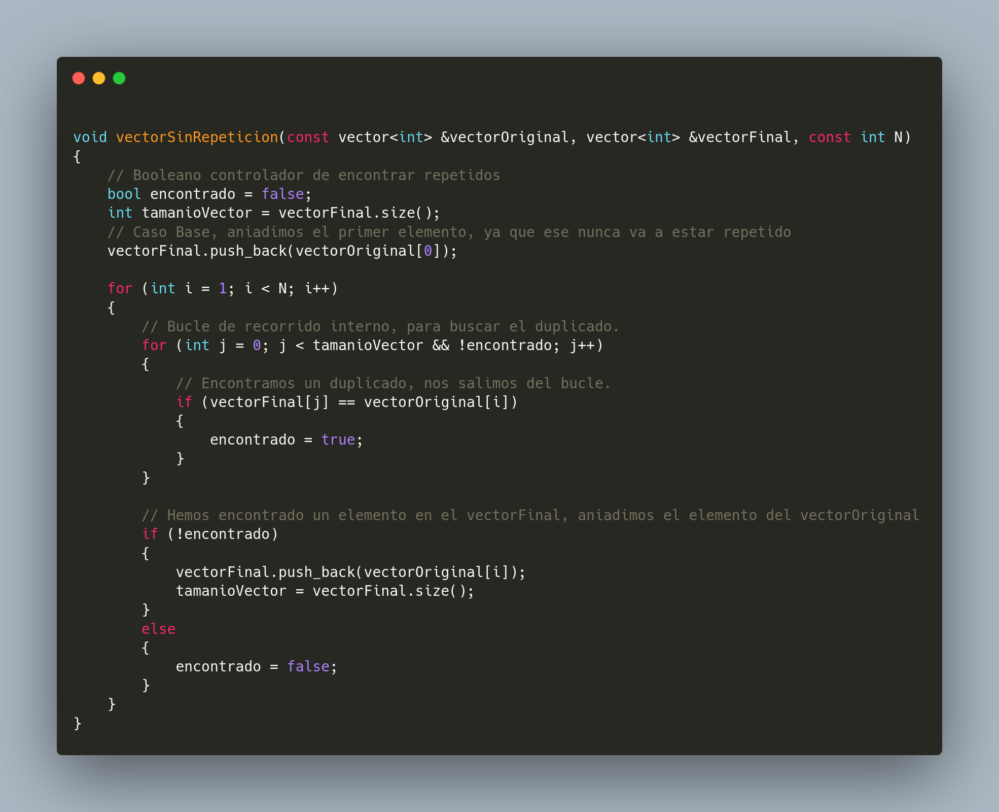
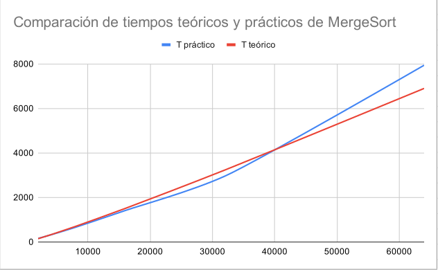
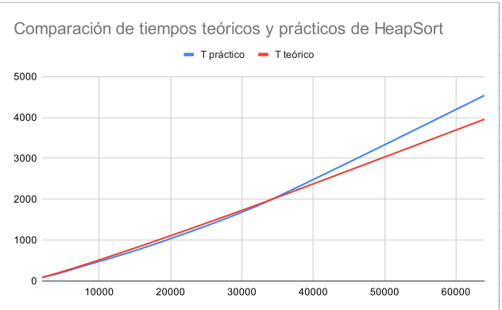

# Práctica 1: Análisis de eficiencia de algoritmos
## Autores: Pedro Antonio Mayorgas Parejo y Alejandro Ramos Peña

\newpage

# Table of contents
- [Práctica 1: Análisis de eficiencia de algoritmos](#práctica-1-análisis-de-eficiencia-de-algoritmos)
  - [Autores: Pedro Antonio Mayorgas Parejo y Alejandro Ramos Peña](#autores-pedro-antonio-mayorgas-parejo-y-alejandro-ramos-peña)
- [Table of contents](#table-of-contents)
- [Ejecución y compilación](#ejecución-y-compilación)
- [Estructura de ficheros](#estructura-de-ficheros)
- [Análisis de eficiencia de algoritmos iterativos de ordenación.](#análisis-de-eficiencia-de-algoritmos-iterativos-de-ordenación)
  - [Pregunta 1 - *Diseño de algoritmo con elementos repetidos sin ordenar.*](#pregunta-1---diseño-de-algoritmo-con-elementos-repetidos-sin-ordenar)
  - [Pregunta 2 - *Diseño de algoritmo con elementos repetidos ordenados.*](#pregunta-2---diseño-de-algoritmo-con-elementos-repetidos-ordenados)
  - [Pregunta 3 - *Identificación de qué variables depende el problema en cada algoritmo diseñado.*](#pregunta-3---identificación-de-qué-variables-depende-el-problema-en-cada-algoritmo-diseñado)
  - [Pregunta 4 y 5 - *Identificación de los peores y mejores casos en cada algoritmo y cálculo de los órdenes de eficiencia.*](#pregunta-4-y-5---identificación-de-los-peores-y-mejores-casos-en-cada-algoritmo-y-cálculo-de-los-órdenes-de-eficiencia)
  - [Pregunta 6 - *Pruebas experimentales de eficiencia teoríca y práctica.*](#pregunta-6---pruebas-experimentales-de-eficiencia-teoríca-y-práctica)
- [Análisis de eficiencia de algoritmos recursivos de ordenación.](#análisis-de-eficiencia-de-algoritmos-recursivos-de-ordenación)
  - [Pregunta 1. *Calculo de la ecuación en recurrencias y el orden del algoritmo en el caso peor, para las funciones Hanoi y HeapSort.*](#pregunta-1-calculo-de-la-ecuación-en-recurrencias-y-el-orden-del-algoritmo-en-el-caso-peor-para-las-funciones-hanoi-y-heapsort)
  - [Pregunta 2. *Comparación de la eficiencia del algoritmo HeapSort con el algoritmo MergeSort.*](#pregunta-2-comparación-de-la-eficiencia-del-algoritmo-heapsort-con-el-algoritmo-mergesort)
    - [*Algoritmo MergeSort*](#algoritmo-mergesort)
    - [*Algoritmo HeapSort*](#algoritmo-heapsort)
    - [*Análisis del algoritmo de HeapSort vs MergeSort*](#análisis-del-algoritmo-de-heapsort-vs-mergesort)

\newpage

# Ejecución y compilación

Este trabajo tiene un makefile asociado que permite la compilación en los siguientes modos:

```bash
# Permite compilar todo el código
make all
# Permite compilar los algoritmos iterativos - Ejercicio 1
make iterativos
# Permite compilar los algoritmos sorting - Ejercicios 2
make sorting
# Permite compilar con los flag de debug para gdb
make debug
# Permite la ejecución de todos los algoritmos con los parámetros preparados
make run
# Permite la ejecución de los algoritmos de ordenación
make runsorting
# Permite la ejecución de los algoritmos iterativos con el array sin ordenar y ordenado
make runiterativos
# Permite la ejecución de los programas con los flags de debug (REQ DEP gdb)
make rundebug
# Permite la creación de la documentación actualizada en PDF (REQ DEP pandoc)
make docs
```
**REQ DEP**: Indica que se requieren dependencias adicionales a instalar en una distribución GNU/Linux.
\newpage 

# Estructura de ficheros
Cada fichero .cpp de los algoritmos se corresponde con una parte de la práctica.

- Parte 1:
  - *algoritmo_sin_ordenar.cpp* Este fichero de código fuente, es el que tiene el problema de descartar los elementos duplicados en un array sin ordenar.
  - *algoritmo_preordenado.cpp* Este fichero de código fuente, es el que tiene el problema de descartar los elementos duplicados en un array preordenado, donde al ser generados los arrays de manera aleatoria, se preordenan con MergeSort.
- Parte 2:
  - *algoritmos_ordenacion.cpp* Este fichero de código fuente, es el que compara MergeSort con HeapSort, al compararse, se generan dos ficheros .csv con el prefijo ordenacion_, donde el sufijo se pone según la salida del algoritmo que corresponda.
- Biblioteca:
  - *algoritmos.hpp*: Biblioteca que contiene:
    - Las funciones siguientes: 
      - ```c++ void vectorSinRepeticion(const vector<int> &vectorOriginal, vector<int> &vectorFinal, const int N)``` Esta función es la que se ejecuta en *algoritmo_sin_ordenar.cpp*
      - ```c++ void repetidosEficienteOrdenado(vector<int> &vectorOriginal, vector<int> &vectorFinal, const int N)``` Esta función es la que se ejecuta en *algoritmo_preordenado*.
      - ```c++ void mergeSort(vector<int> &unorderedVector, const int left, const int right)``` Esta función es el algoritmo recursivo mergeSort, tiene otras funciones internas, como merge que es la que hace la ordenación.
      - ```c++ template <class T> class APO``` Es la clase APO como template, para independizarla de los tipos de datos atómicos. Es del Árbol Parcialmente Ordenado, que es la que contiene el algoritmo de HeapSort, se crea como clase ya que las funciones relacionadas con la ordenación están entrerrelacionadas entre sí. Se ha hecho por que es más cómodo inicializar una clase y llamar al método de ordenación en vez de estar generando en el main varios arrays sueltos, para finalmente llamar a una función suelta.

\newpage

# Análisis de eficiencia de algoritmos iterativos de ordenación.

## Pregunta 1 - *Diseño de algoritmo con elementos repetidos sin ordenar.*
El algoritmo usado para la pregunta 1, es un algoritmo consistente es un doble bucle iterativo que para cada elemento N en un vector original sea repetido o no, se buscará en el vector de los no repetidos de tamaño N. Por lo tanto la eficiencia Big O, es de O(N²).

El fichero main se encuentra en **algoritmo_sin_ordenar.cpp**

El algoritmo que se encuentra en **algoritmos.hpp**, es la función llamada vectorSinRepeticion.



\newpage

## Pregunta 2 - *Diseño de algoritmo con elementos repetidos ordenados.*

El algoritmo usado para la pregunta 2, es un algoritmo consistente en un bucle iterativo simple que recorre todo el vector de manera obligatoria, para poder obtener los elementos (previamente ordenados) donde va pasando a un vector final donde pone los elementos sin repetición.

El algoritmo se encuentra en **algoritmos.hpp**, es la función llamada


\newpage

## Pregunta 3 - *Identificación de qué variables depende el problema en cada algoritmo diseñado.*

El tamaño del problema, depende del tamaño del vector que haya que analizar para quitar los duplicados de manera iterativa. Así como vamos a manejar la lógica de los datos procesados, es decir no solo es el vector de entrada que suele ser N siempre ya que tenemos que iterarlo entero, si no que cómo vamos a procesar dichos datos repetidos, en el algoritmo del ejercicio 2, es mucho más eficiente descartar los repetidos, ya que al estar ordenados no tenemos que desperdiciar accesos de lectura en el vector de salida, ya que con una simple variable auxiliar conocemos cuál es el elemento actual que puede o no repetirse en el vector original.


## Pregunta 4 y 5 - *Identificación de los peores y mejores casos en cada algoritmo y cálculo de los órdenes de eficiencia.*

En el caso del **ejercicio 1**, con un vector de entrada desordenado:

- Si usamos un algoritmo que tenga un bucle anidado consistente en usar el vector desordenado, donde para cada elemento N del vector principal, se compare con cada elemento N del vector de los no repetidos, donde si no existe ese elemento o todos los elementos sean distintos, *su peor caso es N².* *En el mejor de los casos*, existe un elemento igual y es N porque tenemos que ir comprobando en el vector de entrada si hay algún elemento disinto.

**Mejor caso:** Existe un único elemento, pero tenemos que comprobarlo en todo el vector de entrada.
**Peor caso:** Todos los elementos son diferentes. No hay ninguno igual, cada elemento del vector desordenado, tendría que ser comparado con el vector de elementos no repetidos, haciendo que cada iteración del vector desordenado recorra todo el vector de elementos no repetidos hasta encontrar o no una coincidencia.

**Órdenes de eficiencia**:

- *Eficiencia peor caso:* O(N²)
- *Eficiencia mejor caso:* O(N)

En el caso del **ejercicio 2**,donde el vector este ordenado:

- Se usa un bucle que recorra todo el vector, junto a una variable auxiliar que nos permita tener como índice el elemento actual hasta encontrar algún elemento distinto.

**Mejor caso y peor caso:** Da igual cómo se trabaje, el vector al estar ordenado junto al uso de una variable auxiliar, permite que se sepa cuál es el elemento actual para ir descartando rápidamente los repetidos. Solo necesita iterar sobre el vector de los elementos ordenados.

**Órdenes de eficiencia:**

- *Eficiencia mejor y peor caso:* O(N)

\newpage

## Pregunta 6 - *Pruebas experimentales de eficiencia teoríca y práctica.*

Para la ejecución del algoritmo con los datos ordenados tenemos la siguiente tabla:

| N     | T(N) | K          | TE(N)       |
| ----- | ---- | ---------- | ----------- |
| 2000  | 9    | 0,0045     | 8,135416667 |
| 4000  | 17   | 0,00425    | 16,27083333 |
| 8000  | 29   | 0,003625   | 32,54166667 |
| 16000 | 64   | 0,004      | 65,08333333 |
| 32000 | 123  | 0,00384375 | 130,1666667 |
| 64000 | 268  | 0,0041875  | 260,3333333 |

Con un promedio de las constantes de: **0,004067708333**

El gráfico sería el siguiente:


\newpage

Para la ejecución del algoritmo con los datos sin ordenar tenemos la siguiente tabla:

| N     | T(N)   | K               | TE(N)       |
| ----- | ------ | --------------- | ----------- |
| 2000  | 940    | 0,000235        | 686,3686523 |
| 4000  | 2567   | 0,0001604375    | 2745,474609 |
| 8000  | 19253  | 0,000160203125  | 10981,89844 |
| 16000 | 40338  | 0,0001575703125 | 43927,59375 |
| 32000 | 162624 | 0,0001588125    | 175710,375  |
| 64000 | 645241 | 0,000157529541  | 702841,5    |

Con un promedio de las constantes de: **0,0001715921631**

El gráfico sería el siguiente:


*Conclusiones:*

Es poco eficiente hacer un algoritmo iterativo para eliminar duplicados sin que los datos estén sin ordenar. Deberían ordenarse previamente, así se pueden descartar los datos mucho más rápido.

\newpage

# Análisis de eficiencia de algoritmos recursivos de ordenación.

## Pregunta 1. *Calculo de la ecuación en recurrencias y el orden del algoritmo en el caso peor, para las funciones Hanoi y HeapSort.*

*Ecuación en recurrencia Hanoi*
```
Hanoi
T(n) = {
  1 n = 0
  2T(n-1) + 1 n > 0
}
```

*Ecuación en recurrencias HeapSort y sus algoritmos relacionados*
```
HeapSort
T(n) = 2n * O(log n) + O(1) E O(n * log n)

insertarEnPos
T(n) = {
  1 n = 0
  1 + T(n/2) n > 2
}

Reestructurar raíz

T(n) = {
  1 n = 0
  T(n/2)+O(1) n > 0
}
```

**Del algoritmo de Hanoi**

Como podemos ver, en el algoritmo recursivo de Hanoi cuando n es mayor que 0 se hacen 2 llamadas a recursivas a la función con un tamaño de n-1, además de la operación de mover un disco que tiene una eficiencia constante.
Su ecuación recursiva sería T(n)=1 si n=0 ; 2T(n-1)+1 si n>0.

Resolviendo la ecuación recursiva tenemos que el polinomio característico 
de la función es (x-2)(x-1) (sus dos raices) y que la ecuación del tiempo nos quedaría tal que: 
t(n) = c1 * 2^n + c2 * 1^n, que pertenece al orden de eficiencia 2^n.

**Del algoritmo Heapsort en una función**

- El algoritmo de HeapSort llama para un problema de tamaño n, n veces a dos algoritmos de eficiencia log(n), es por eso que el orden de eficiencia del algoritmo es de n * log(n), ya que sería de eficiencia 2n * log(n) que pertenece al orden O(n * log(n)).

**De la función insertar en pos**

Cuando se hace la llamada recursiva lo hacemos con la posición pos, que ha sido dividida entre dos pues depende de la altura del árbol que en el peor de los casos será n/2. Además le sumamos una eficiencia constante pues se hacen comparaciones y asignaciones las cuales son de orden 1.
Esto nos da que tiene una eficiencia de orden log(n).

**De la función reestructurar raíz**

Para reeestructurarRaiz tenemos lo mismo, pero la posición en vez de empezar en un número alto comienza en el más bajo y se va multiplicando por 2, es por eso que la llamada recursiva que se hace tendrá un tamaño de n/2, ya que también depende de la altura del árbol que en el peor de los casos será de n/2. Al igual que en insertarPos le añadimos un orden constante por las comparaciones y asignaciones que se hacen, que son de orden constante.
Esto nos da que tiene una eficiencia de orden log(n).

\newpage

## Pregunta 2. *Comparación de la eficiencia del algoritmo HeapSort con el algoritmo MergeSort.*

### *Algoritmo MergeSort*

Para la ejecución del algoritmo con el algoritmo *MergeSort* tenemos la siguiente tabla:

| N     | T(N) | K             | TE(N)       |
| ----- | ---- | ------------- | ----------- |
| 2000  | 159  | 0,02408339218 | 148,1201142 |
| 4000  | 317  | 0,02200129931 | 323,2551887 |
| 8000  | 660  | 0,02113709914 | 700,5402982 |
| 16000 | 1415 | 0,02103591248 | 1509,140438 |
| 32000 | 2960 | 0,02053205785 | 3234,40056  |
| 64000 | 7943 | 0,02582287298 | 6901,040486 |

Con un promedio de las constantes de: **0,02243543899**

El gráfico sería el siguiente:



\newpage

### *Algoritmo HeapSort*

Para la ejecución del algoritmo con el algoritmo *HeapSort* tenemos la siguiente tabla:

| N     | T(N) | K             | TE(N)       |
| ----- | ---- | ------------- | ----------- |
| 2000  | 93   | 0,01408651241 | 84,93027136 |
| 4000  | 169  | 0,01172939932 | 185,3505923 |
| 8000  | 377  | 0,01207376723 | 401,6812839 |
| 16000 | 798  | 0,01186336266 | 865,3227664 |
| 32000 | 1826 | 0,01266606001 | 1854,56593  |
| 64000 | 4542 | 0,01476614492 | 3956,972653 |

Con un promedio de las constantes de: **0,01286420776**

El gráfico sería el siguiente:




### *Análisis del algoritmo de HeapSort vs MergeSort*

Los algoritmos tienen una eficiencia asintótica similar, es decir que tienen una complejidad de peor caso O(n log n), sin embargo hay diferencias vitales en los códigos que permiten elegir un código o otro. Si nos preocupa la memoria, el algoritmo HeapSort es el mejor ya que no hace una copia de los datos fuera del vector o la estructura de datos original generalmente un array, generando un estrés adicional sobre accesos a memoria y copia de datos. Generando un proceso de copia adicional de O(n).

Si nos preocupa la estabilidad, es decir que se mantenga un orden relativo de los elementos dentro del heap que crea el algoritmo. MergeSort no es estable cuando la ordenación depende de más de un parámetro o variable. Por lo que puede dar a ordenaciones incorrectas aunque aparentemente esté ordenado.