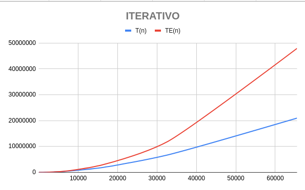
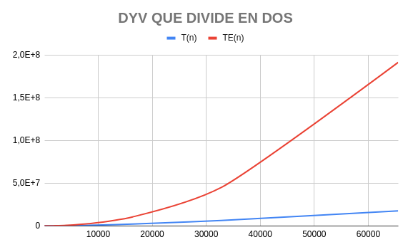
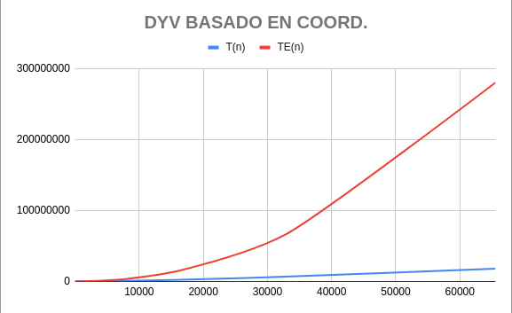
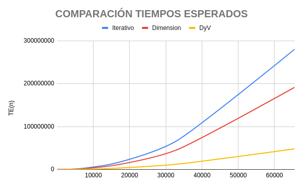

# Práctica 2: Algoritmos Divide y Vencerás
## Autores: Pedro Antonio Mayorgas Parejo y Alejandro Ramos Peña

\newpage

# Tabla de contenidos
- [Práctica 2: Algoritmos Divide y Vencerás](#práctica-2-algoritmos-divide-y-vencerás)
  - [Autores: Pedro Antonio Mayorgas Parejo y Alejandro Ramos Peña](#autores-pedro-antonio-mayorgas-parejo-y-alejandro-ramos-peña)
- [Tabla de contenidos](#tabla-de-contenidos)
- [Ejecución y compilación](#ejecución-y-compilación)
- [Estructura de ficheros](#estructura-de-ficheros)
- [Análisis del algoritmo iterativo.](#análisis-del-algoritmo-iterativo)
  - [Explicación breve de cómo funciona.](#explicación-breve-de-cómo-funciona)
  - [Análisis del orden de eficiencia.](#análisis-del-orden-de-eficiencia)
  - [Tabla de tiempos de ejecución.](#tabla-de-tiempos-de-ejecución)
- [Análisis del algoritmo Divide and Conquer que divide por la mitad.](#análisis-del-algoritmo-divide-and-conquer-que-divide-por-la-mitad)
  - [Explicación breve de cómo funciona.](#explicación-breve-de-cómo-funciona-1)
  - [Análisis del orden de eficiencia.](#análisis-del-orden-de-eficiencia-1)
  - [Tabla de tiempos de ejecución.](#tabla-de-tiempos-de-ejecución-1)
- [Análisis del algoritmo Divide and Conquer que divide basándose en la media de una coordenada.](#análisis-del-algoritmo-divide-and-conquer-que-divide-basándose-en-la-media-de-una-coordenada)
  - [Explicación breve de cómo funciona.](#explicación-breve-de-cómo-funciona-2)
  - [Análisis del orden de eficiencia.](#análisis-del-orden-de-eficiencia-2)
  - [Tabla de tiempos de ejecución.](#tabla-de-tiempos-de-ejecución-2)
- [Comparación de tiempos esperados y problema del umbral.](#comparación-de-tiempos-esperados-y-problema-del-umbral)

\newpage

# Ejecución y compilación

Este trabajo tiene un makefile asociado que permite la compilación en los siguientes modos:

```bash
# Permite compilar todo el código
make all
# Permite compilar los algoritmos iterativos - Ejercicio 1
make iterativos
# Permite compilar el algoritmos de divide and conquer básico
make dcd
# Permite compilar el algoritmo de divide and conquer basado en las coordenadas
make dimension
# Permite compilar con los flag de debug para gdb
make debug
# Permite la ejecución de todos los algoritmos con los parámetros preparados
make run
# Permite la creación de la documentación actualizada en PDF (REQ DEP pandoc)
make docs
```
**REQ DEP**: Indica que se requieren dependencias adicionales a instalar en una distribución GNU/Linux.
\newpage 

# Estructura de ficheros
Cada fichero .cpp de los algoritmos se corresponde con una parte de la práctica.

- Main:
  - *maindimension.cpp* Este fichero de código fuente, es el que tiene un algoritmo de divide and conquer basado en la división de subproblemas por la media de cada coordenada rotada de manera circular.
  - *maindcdnotordered.hpp* Este fichero de código fuente, es el que tiene la ejecución del problema de divide and conquer básico.
  - *mainiterativo.cpp* Este fichero de código fuente, es el que tiene la ejecución del algoritmo iterativo. 
- Biblioteca:
  - *dcdnotordered.hpp*: Biblioteca que contiene:
    - La clase de DCD que tiene dos constructores, donde uno tiene un vector por defecto preparado como test de prueba para verificar que el algoritmo se ejecuta correctamente. Otro constructor que genera de manera aleatoria un número arbitrario de puntos.
  - *iterativo.hpp*: Biblioteca que contiene:
    - La clase non_dominated_iterative que tiene dos constructores, donde uno tiene el mismo vector preparado como test de prueba para verificar que el algoritmo se ejecuta correctamente. Otro constructor que genera de manera aleatoria un número arbitrario de puntos.
  - *dcddimension.hpp*: Biblioteca que contiene:
    - La clase DCDDIMENSION contiene dos constructores, donde uno tiene un vector por defecto preparado como test de prueba para verificar que le algoritmo se ejecuta correctamente. Otro constructor que genera de manera aleatoria un número arbitrario de puntos.

\newpage

# Análisis del algoritmo iterativo.

## Explicación breve de cómo funciona.

Este algoritmo es un algoritmo que tiene un bucle triple, en el cual en el primer bucle se recoge un punto que se va comparando con todos los demás puntos excepto por el mismo, buscando si es un no dominado. En el caso de que se encuentre que es un no dominado, se añade al final de todas las comprobaciones con los demás puntos.

No se puede simplificar la iteración interna, ya que la omisión de cualquier punto implica que no se pueda comparar de manera correcta, sin embargo sí borramos los puntos que sean dominados por el punto del bucle externo, lo cual causa que en las siguientes iteraciones se vaya recortando el número de iteraciones del bucle interno. Lo cual implica que el peor caso que es la eficiencia calculada del iterativo nunca ocurra ya que siempre habrá algún punto dominado por otro, que lo eliminemos de los vectores de evaluación.

## Análisis del orden de eficiencia.

El peor caso sería en el que todos los puntos sean no dominados (lo cual es muy raro) y entonces se compararían todos con todos (O(N²)).
El mejor caso sería en el que solo hay un no dominado, caso en el cual solamente hariamos una comparación por elemento del vector, es decir, tendríamos una eficiencia
de O(N).

**Órdenes de eficiencia**:

- *Eficiencia peor caso:* O(N²)
- *Eficiencia mejor caso:* O(N)

## Tabla de tiempos de ejecución.

Para la ejecución del algoritmo iterativo para encontrar no dominados tenemos la siguiente tabla:

| N     | T(N)     | K              | TE(N)       |
| ----- | -------- | -------------- | ----------- |
| 32    | 17       | 0,0166015625   | 11,42695161 |
| 64    | 59       | 0,01440429688  | 45,70780643 |
| 128   | 231      | 0,01409912109  | 182,8312257 |
| 256   | 872      | 0,01330566406  | 731,3249029 |
| 512   | 3590     | 0,01369476318  | 2925,299611 |
| 1024  | 13430    | 0,01280784607  | 11701,19845 |
| 2048  | 48772    | 0,01162815094  | 46804,79378 |
| 4096  | 170241   | 0,01014715433  | 187219,1751 |
| 8192  | 594525   | 0,008859112859 | 748876,7005 |
| 16384 | 1926479  | 0,007176693529 | 2995506,802 |
| 32768 | 6767230  | 0,006302474067 | 11982027,21 |
| 65536 | 20971250 | 0,004882749636 | 47928108,83 |

Con un promedio de las constantes de: **0,01115913243**

El gráfico sería el siguiente:



\newpage

# Análisis del algoritmo Divide and Conquer que divide por la mitad.

## Explicación breve de cómo funciona.

Este algoritmo funciona de la siguiente manera:

1. Partiendo de que generamos una lista de puntos que es estructurada en un vector. La dividimos en dos mediante referencias, para evitar el proceso de copia de los vectores.
2. Si el tamaño de el vector no es de 1, se volvería a dividir.
3. Si el tamaño del vector es 1 se devuelve el vector sin más.
4. Después se combinan comparando los no dominados de la izquierda y la derecha, comprobando si alguno de la derecha domina a alguno de la izquierda y viceversa.
   1. Si el punto de los no dominados de la derecha domina a el de la izquierda, el de la izquierda se elimina y continua.
   2. Si el punto de la derecha es dominado, pondremos a false un booleano que nos dice si este es no dominado.
   3. Si ninguno de los dos se domina entre ellos, se continua.
   4. Si después de comparar el de la derecha con todos los de la izquierda es no dominado, agregaremos este al vector de la izquierda como solución.
   5. Continuamos con el siguiente punto de la derecha.
5. Devolvemos el vector resultado de combinar izquierda y derecha.

## Análisis del orden de eficiencia.

El algoritmo puede ser más ineficiente en algunos casos debido a que se hacen más comparaciones que en un iterativo.
En otros casos, al estar dividiendo el problema en subproblemas más pequeños, la función para combinar que se hace acabará haciendo muchísimas menos iteraciones
que en un iterativo.
- La función recursiva divide en dos el vector y llama a la recursividad para cada mitad.
- Después se ejecuta una función combina que en el peor caso tendría una eficiencia de O(N).
Teniendo esto en cuenta, ya que la función divide en dos y se llama a una función de O(N), sabemos que el orden de eficiencia es de O(N*log(N))

**Órdenes de eficiencia**:

- *Eficiencia peor y mejor caso:* O(N*log(N)).


## Tabla de tiempos de ejecución.
Para la ejecución del algoritmo dyv que divide por la mitad para encontrar no dominados tenemos la siguiente tabla:

| N     | T(N)     | K               | TE(N)       |
| ----- | -------- | --------------- | ----------- |
| 32    | 28       | 0,01816679427   | 14,26495074 |
| 64    | 99       | 0,01338179042   | 68,47176357 |
| 128   | 1530     | 0,04431631893   | 319,5348967 |
| 256   | 1384     | 0,008769127814  | 1460,730956 |
| 512   | 5156     | 0,007259733945  | 6573,289303 |
| 1024  | 19940    | 0,006317066785  | 29214,61913 |
| 2048  | 51255    | 0,003690403689  | 128544,3242 |
| 4096  | 188616   | 0,003112200844  | 560920,6872 |
| 8192  | 563060   | 0,002143984612  | 2430656,311 |
| 16384 | 2009634  | 0,001776393941  | 10470519,49 |
| 32768 | 6224799  | 0,001283879993  | 44873654,98 |
| 65536 | 17499139 | 0,0008459156595 | 191460927,9 |

Con un promedio de las constantes de: **0,009255300908**
El gráfico sería el siguiente:



\newpage

# Análisis del algoritmo Divide and Conquer que divide basándose en la media de una coordenada.

## Explicación breve de cómo funciona.

El enfoque de este algoritmo es el mismo que en el divide y vencerás que comentamos anteriormente, solo que en vez de dividir por la mitad, dividiremos en base a el valor de una coordenada.
Funciona de la siguiente manera:

El algoritmo tiene de entrada el conjunto (set) en el cual queremos encontrar puntos no dominados y la coordenada en la que vamos a dividir:
1. Calculamos la media de la coordenada que introducimos como parámetro de la función recursiva (i).
2. Dividimos el conunto (set) en puntos con un valor mayor o igual que la media y puntos con un valor menor.
3. Hacemos la llamada recursiva para un conjunto y otro, pero la dimensión en la que dividimos será (i+1)%K (hacemos el módulo para que sea circular). La llamada recursiva se hará hasta que devuelva un vector de tamaño 1.
4. Hacemos la combinación de los dos conjuntos usando el mismo algoritmo de combinación que en el DyV que divide por la mitad.
5. Devolvemos el conjunto resultado de la combinación.


## Análisis del orden de eficiencia.

La división en este algoritmo no se hace de manera equitativa, pues dependiendo de la media se dividirá de una manera u otra. Es decir los subconjuntos generados para analizarlos con los subproblemas, no es igual a que si lo partieramos solo por la mitad, puede darse el caso en el que haya un conjunto de 4 puntos y se reparta con 1 punto en el subconjunto de la izquierda y con 3 en el de la derecha. Todo eso porque la media es el corte.
En cada llamada a la función se calcula la media, cuyo calculo tiene un coste de N.
Se llama a la función combinar que es de orden O(N).
Y al dividir, sabemos que el orden sería de log(N).
Es decir, en el mejor caso, el conjunto se divide de manera equitativa y tendriamos un orden O(N*log(N)).
En el peor caso, el conjunto se divide de manera no eficiente, lo que nos da un orden de O(N²).

**Órdenes de eficiencia**:

- *Eficiencia mejor caso:* O(N*log(N))
- *Eficiencia peor caso:* O(N²).
  
## Tabla de tiempos de ejecución.
Para la ejecución del algoritmo dyv que divide por la mitad para encontrar no dominados tenemos la siguiente tabla:

| N     | T(N)     | K               | TE(N)       |
| ----- | -------- | --------------- | ----------- |
| 32    | 54       | 0,03503596038   | 20,88222747 |
| 64    | 151      | 0,02041060963   | 100,2346918 |
| 128   | 529      | 0,01532243968   | 467,7618953 |
| 256   | 9356     | 0,05928031779   | 2138,340093 |
| 512   | 6679     | 0,009404143332  | 9622,530417 |
| 1024  | 24617    | 0,007798757926  | 42766,80185 |
| 2048  | 72906    | 0,005249294144  | 188173,9281 |
| 4096  | 211120   | 0,00348352124   | 821122,5955 |
| 8192  | 671259   | 0,00255597799   | 3558197,914 |
| 16384 | 2084877  | 0,001842904166  | 15327621,78 |
| 32768 | 6466119  | 0,001333652832  | 65689807,64 |
| 65536 | 17927433 | 0,0008666195696 | 280276512,6 |

Con un promedio de las constantes de: **0,01354868322**
El gráfico sería el siguiente:


El gráfico sería el siguiente:



# Comparación de tiempos esperados y problema del umbral.

No merece la pena en nuestros algoritmo buscar un umbral donde haya que saltar desde el algoritmo iterativo al DyV. El DyV tiene el mismo núcleo que el iterativo por lo que se comporta de una manera casi igual. Pero en conjuntos más grandes la división en subconjuntos y el análisis de estos como subproblema hace que no tenga que hacerse las comparaciones de manera exponencial o lineal según los casos. 

En el algoritmo DyV cuyo corte es la media de la coordenada, se comporta mucho mejor en conjuntos de puntos grandes que el iterativo, pero debido a que debemos realizar los cálculos de manera iterativa con la sumatoria, se añade mayor complejidad computacional siendo este peor que el de DyV por la mitad.

El DyV que divide por la mitad tiene un enfoque simple, se divide por la mitad los subconjuntos hasta encontrar un caso base, a partir de ahí se van analizando los conjuntos de puntos retornados hacía arriba como subproblemas, donde se pueden descartar mucho mas eficazmente que si comparamos todo el conjunto en un bloque.

Véase en la gráfica donde comparamos los tiempos esperados después de calcular la constante oculta como se cumple lo explicado anteriormente: 


El gráfico sería el siguiente:

